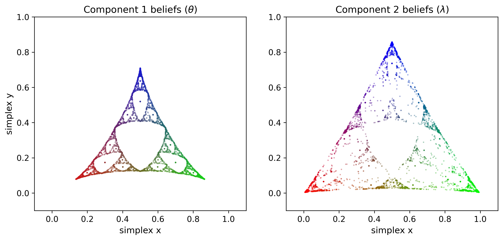
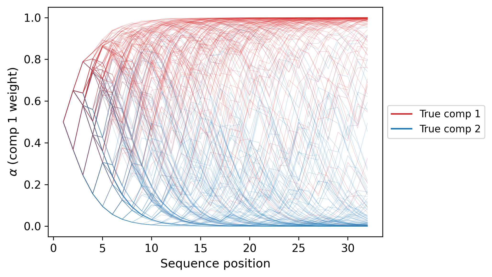
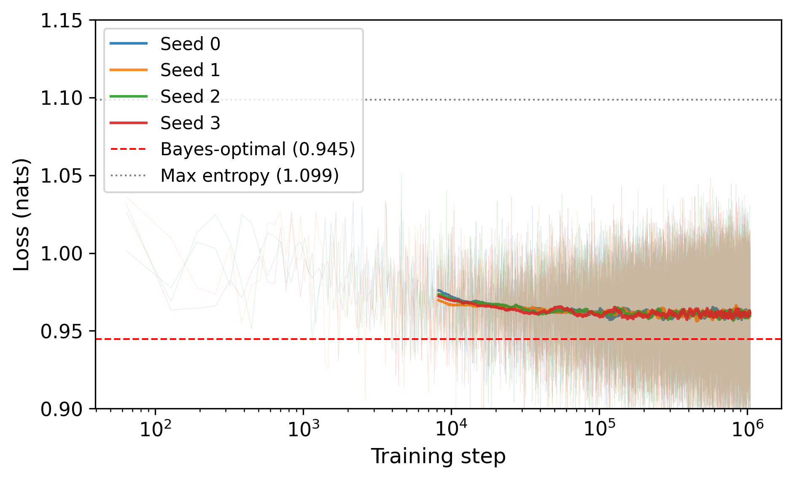
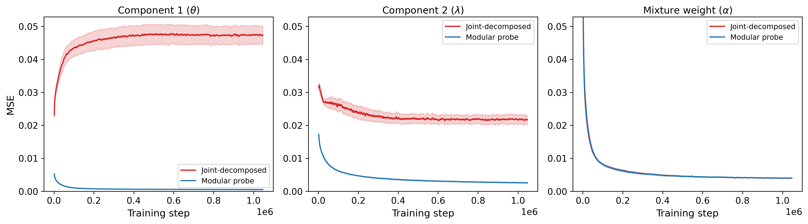
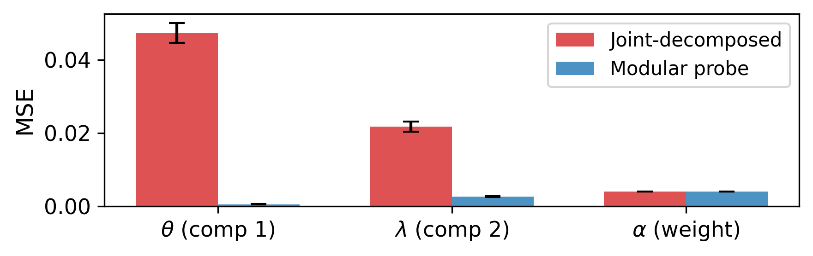

Introduction
------------

The goal of this project is to explore how transformers learn to predict the
emissions of a "block mixture" hidden Markov model (HMM) constructed from a
pair of disconnected, simpler HMMs with the same alphabet. Sequences are
randomly initialised into one of the states of either HMM and proceed to
traverse its state space. The transformer needs to simultaneously track beliefs
about which component HMM is generating a sequence, and in which state that HMM
is, in order to accurately predict the sequence.

This question is interesting because the block mixture processes of this form
are a relevant example of data generating processes that exhibit modularity.
Real-world data generating processes are modular in several important ways,
including compositionality (Lin, Tegmark, Rolnick, 2016) and factorisation
(Shai et al.\ 2026). We here study a related kind of modularity, namely a form
of hierarchical or conditional generation where some aspects of the latent
dynamics of a data generating process (here the dynamics of the chosen HMM)
branch based on the values of other latent variables (here the choice of HMM).

By studying how deep learning responds to this kind of structure in the data
generating process we gain a deeper understanding of the kinds of computational
structure that transformers are sensitive to, as well as insights into the ways
they tend to represent beliefs over latent variables. Thus we make gradual
progress towards a greater foundation for understanding frontier and future AI
systems, including the kinds of risks they might pose if designed
inappropriately.

Theory
------

In this section, we recall the theory of belief state geometry and derive a
connection between the belief dynamics in a block mixture HMM and the belief
dynamics of each component of the mixture.

### Background: HMM belief dynamics

\newcommand\States{\mathcal{S}}
\newcommand\Prob{\mathbb{P}}
\newcommand\Reals{\mathbb{R}}

Formally, an HMM is a tuple $(\States, \Sigma, T, \mu)$ where
  $\States$ is a finite set of $n$ states,
  $\Sigma$ is a finite alphabet of $m$ tokens,
  $T$ is a transition kernel (we write $T^{(x)}_ {i,j}$ for the probability of
  a transition to state $j \in \States$ emitting symbol $x \in \Sigma$
  conditional on starting in state $i \in \States$),
and
  $\mu \in \Reals^n$ is an initial state distribution.
Allow me to skip a detailed description of the semantics due to time
constraints.

Given an HMM and a sequence of emissions $x_1, \ldots, x_t$, the Bayes-optimal
prediction for symbol $x_{t+1}$ is given by first computing a Bayesian
posterior over the latent state given the tokens so far,
$$\tag{1}
  \eta_t
  = \frac{\mu T^{(x_1)} \cdots T^{(x_t)}}
    {||\mu T^{(x_1)} \cdots T^{(x_t)}||}
  \in \Reals^n
$$
where, as throughout, we use a convention of row vectors and $||\cdot||$
represents the $L_1$ norm. Note that this implies $\eta_0 = \mu$. Specifically,
given $\eta_t$, we can predict symbol $x$ will occur with probability
$||\eta_t T^{(x)}||$.

Equation (1) describes a transition system through the space of categorical
probability distributions on $n$ items, that is, the $(n-1)$-simplex. Shai et
al.\ (2024) found that transformers (and other sequence models) linearly
represent beliefs over latent states in their residual stream for simple HMMs.

### Block mixture HMM belief dynamics

The goal of this project is to explore what happens when a transformer is
trained on HMMs that have a certain structure. The structure is that of the
following "block mixture" operation on HMMs. Let $H_1 = (\States_1, \Sigma,
T_1, \mu_1)$ and $H_2 = (\States_2, \Sigma, T_2, \mu_2)$ be two HMMs with a
shared alphabet. Form a combined HMM $H = H_1 \oplus H_2 = (\States, \Sigma, T,
\mu)$ as follows:

* The combined set of states $\States = \States_1 \sqcup \States_2$ is the
  disjoint union of the component sets. If $H_1$ has $n_1$ states and $H_2$
  has $n_2$ states then the combined state set has $n = n_1 + n_2$ states.

* The combined transition kernel $T$ is such that for each $x$, the transition
  matrix is given in block form by
  $$
  T^{(x)} = \begin{bmatrix}
    T_1^{(x)} & 0 \\
    0 & T_2^{(x)}
  \end{bmatrix},
  $$
  where we use the convention that the rows and columns of this matrix are
  taken in order of the states of $H_1$ followed by those of $H_2$.

* The combined initial state distribution is given by the block row vector
  $\mu = \left[ \frac12 \mu_1 ~~~ \frac12 \mu_2 \right]$.

Intuitively, the effect is that the HMM decides by a fair coin which state
subset to start in and then chooses its state with the corresponding initial
state distribution.

Thereafter the transition dynamics proceed unchanged within that component of
the combined HMM as if we had started with the corresponding component HMM, and
in particular there is no probability of "crossover" (the components are
disconnected). The lack of crossover makes this a non-ergodic process (though
each component may be ergodic).

As $H = H_1 \oplus H_2$ is an HMM we can predict its tokens using equation (1).
However due to the special structure of $H$ an alternative approach is
available to us. Equation (1) simplifies in this case to a set of belief update
equations that include those of the component HMMs $H_1$ and $H_2$.

We adopt the convention of using the letter $\eta$ to refer to a belief state
of $H$ while reserving $\theta$ for a belief state of $H_1$, and $\lambda$ for
a belief state of $H_2$. Then we have by equation (1) applied to each process
that
$$\begin{align*}
  \eta_t
  &= \frac{\mu T^{(x_1)} \cdots T^{(x_t)}}
    {||\mu T^{(x_1)} \cdots T^{(x_t)}||}
  \in \Reals^{n},
  \tag{2}
\\
  \theta_t
  &= \frac{\mu_1 T_1^{(x_1)} \cdots T_1^{(x_t)}}
    {||\mu_1 T_1^{(x_1)} \cdots T_1^{(x_t)}||}
  \in \Reals^{n_1},
\\
  \lambda_t
  &= \frac{\mu_2 T_2^{(x_1)} \cdots T_2^{(x_t)}}
    {||\mu_2 T_2^{(x_1)} \cdots T_2^{(x_t)}||}
  \in \Reals^{n_2}.
\end{align*}$$
Then note that because of the block structure of $\mu$ and $T$ we can express
the first of these in terms of the second two as
$$\tag{3}
\eta_t = \left[\alpha_t \theta_t ~~~ (1-\alpha_t) \lambda_t \right]
$$
where
$$
  \alpha_t = \frac
  {||\mu_1 T_1^{(x_1)} \cdots T_1^{(x_t)}||}
  {||\mu_1 T_1^{(x_1)} \cdots T_1^{(x_t)}|| + 
  ||\mu_2 T_2^{(x_1)} \cdots T_2^{(x_t)}||}
$$
is a mixture weight given by the fraction of evidence for the sequence
accounted for by $H_1$.

### Predictions

In summary, we have derived two methods for tracking belief dynamics in the
case of mixture HMMs.

1. *Joint representation.* Equation (2) describes belief dynamics playing out
   on an $(n-1)$-simplex as in the general case described previously.

2. *Modular representation.* Equation (3) allows us to separately track a
   belief about the state conditional on being in $H_1$ ($\theta_t$) on an
   $(n_1-1)$-simplex; along with a belief about the state conditional on being
   in $H_2$ on an $(n_2-1)$-simplex; along finally with a mixture weight that
   can be interpreted as a belief about which HMM we are in (on a $1$-simplex).

Note that neither approach yields a dimensionality advantage over the other,
since we have
  $$(n_1-1) + (n_2-1) + 1 = n_1 + n_2 - 1 = n - 1.$$
However, one or the other approach may be preferable in terms of the ease of
implementation of the belief update, or due to some other aspect such as a
general preference for or against modularity.

With regards to a hypothetical transformer, we noted both possible
representations before running any experiments, but were unable to predict
confidently that either one or the other would be linearly encoded in the
residual stream.

We noted it was also possible that the transformer would find some other
representation entirely. For example, one could parameterise the same space
using logits rather than linearly representing probabilities. However, given
the linear representations uncovered by Shai et al.\ (2024, 2026), linear
probabilistic representations seemed more likely than logits. Note that this
and the other representations are all reparameterisations of the same
information; however they are generally non-linear reparameterisations meaning
that at most one can be linearly encoded in a given low-dimensional subspace of
activation space.

We noted several other predictions (though we have not had a chance to test
these yet):

* If $H_1$ is equal to $H_2$ then the above description contains redundancy. We
  should not expect the transformer to use extra dimensions in this case. The
  same would be true if the HMMs were factorisable or non-minimal.

* If $\alpha$ ever drew extremely close to $1$ or $0$, the transformer may
  round it off and continue tracking beliefs for only the inferred component in
  order to save computation.

Experiments
-----------

In this section, we describe our methodology and results for experiments
investigating the internal representations of transformers trained on data from
a block mixture HMM. The main result is suggestive evidence in the form of a
probe loss comparison that transformers linearly represent their belief state
in a modular fashion.

### Data generation

We generate training data from a block mixture HMM formed from two instances of
the parameterised Mess3 process as described in Shai et al.\ (2026, appendix
C.1). In particular, we used
  $H_1 = \text{mess3}(\alpha=0.6, x=0.15)$
and
  $H_2 = \text{mess3}(\alpha=0.85, x=0.05)$.
We omit the details from this report due to time constraints.
Figures 1 and 2 show examples of ground truth belief dynamics in the component
processes and dynamics of the mixture weights over sequence position for a
sample of sequences from the process $H = H_1 \oplus H_2$.

Note that in this case $n_1 = n_2 = |\Sigma| = 3$, and we generate sequences of
length 32 symbols.

**Figure 1:** Ground-truth belief dynamics for a sample of trajectories in
$H_1$ (left), $H_2$ (right).

**Figure 2:** Ground-truth mixture weight dynamics for a sample of trajectories
in $H = H_1 \oplus H_2$.

### Transformer training

We use a decoder-only transformer with pre-layer normalisation, learnable
positional embeddings, and causal masking. Specifically, we use 4 layers and an
embedding size of 64. Each attention layer has 2 heads of dimension 16. Each
MLP layer has 256 hidden neurons. A final layer normalisation precedes a
learned affine output head that produces one logit for each possible next
token.

We train with cross-entropy loss using stochastic mini-batch gradient descent.
We use a learning rate of 0.01 and a batch size of 64. We train for $2^{20}
\approx 1$ million steps. We train using four independent seeds. The learning
curve is shown in Figure 3.

**Figure 3:** Learning curve for transformer training experiments. Training
quickly approaches and then plateaus above the Bayes-optimal cross entropy for
the data generating process, with large per-step variance. Faded lines show
loss sampled every 64 steps, solid lines show rolling average.

### Probing representations

In order to distinguish between the joint representation and the modular
representation within the transformer's activations we continually train linear
probes on the transformer's final layer activations throughout training.

1. We train one probe to reconstruct the full joint belief distribution
   $\eta_t$ at each sequence position for a fixed batch of sequences.

2. From the same activation and sequence data we train two probes
   reconstructing $\theta_t$ and $\lambda_t$ and one probe reconstructing
   $\alpha_t$.

While both sets of probe targets encode equivalent information, they are
related by the nonlinear transform shown in equation (3). We apply the inverse
of this transform to decompose the joint beliefs into conditionals for each
component and marginals and then evaluate the resulting MSE over training.

Figure 4 shows the result. We can clearly see that the decomposed joint beliefs
maintain a much higher MSE than the probes for each component, and equal MSE
for the mixture weight. The former observation indicates that the
representations are much closer to a linear representation of the component
dynamics than the joint dynamics. The latter observation the mixture weight MSE
is identical is unsurprising given that the mixture weight is a linear function
of the joint representation.

**Figure 4:** Modular probe MSE versus equivalent MSE for the decomposition of
the joint probes. *Top:* probe MSE versus training time for each component and
mixture weight. *Bottom:* probe MSE at end of training for each component and
mixture weight.

Future work
-----------

These results are rather preliminary and warrant more systematic
investigation. We outline some important limitations of our analysis below.
Then, we outline several potential directions for extending our analysis deeper
into non-ergodic belief dynamics.

### Limitations of analysis

Some important limitations of the analysis are as follows.

* We have not tested whether the directions identified by the per-component
  probes are orthogonal.

* We should use held-out ground truth belief dynamics data rather than probe
  training data to evaluate the probes.

* We should study how probe accuracy depends on layer (at the moment only
  testing final layer activations as probe inputs).

* We should test whether the hypothetical representations are causally involved
  in transformer predictions by seeing if we can intervene on the
  representations and change the transformer's predictions.

### Continuous latents and infinite mixtures

We have considered a block mixture of only two component HMMs. It is possible
to consider adding additional components *ad infinitum.* Beyond a certain
point, the transformer will not be able to dedicate independent dimensions to
all of the possible disconnected components.

Fortunately, if a continuum of processes has some special structure (such as
for example the parameterised family of Mess3 processes with different values
of the $\alpha$ and $x$ parameters) then we might expect a transformer to still
be able to make progress. Future work could investigate this case as follows:

* Theoretically investigate the belief dynamics for each component as a
  function of the continuum of parameters and the resulting dynamics of the
  mixture density representing the posterior over parameters.
* Find some process that has analytically tractable dynamics in this case.
* Train a transformer on data generated in this way and see how it represents
  the parameterised belief dynamics.

If a process with simple enough structure could be found, this would be an
interesting example of learning to infer not just the underlying process's
state but also its transition dynamics in context.

We note that in related work, Edelman et al.\ (2024) trains a transformer to
predict the transitions of a Markov chain with unknown transition dynamics in
context (no hidden states). In this connection, we should also mention Park et
al.\ (2025) who have shown that the transformer can learn to generalise to
predicting these kinds of Markov chains from a large enough finite block
mixture data generating process (see also Raventos et al., 2023).

### Approximate block mixtures

We have seen at least preliminary evidence that the transformer prefers to
implement belief tracking in a modular fashion in the case of a simple block
mixture process. We could investigate the strength of this inductive bias by
seeing whether the transformer will continue to prefer this representation over
the 5-dimensional joint representation even when it becomes suboptimal.

To induce a suboptimal block mixture representation we could mix into the block
mixture process $H$ a random noise process (or some other indecomposable
process) with weight $\epsilon$ as in the "indecomposable generators" setting
studied in Shai et al.\ (2026). Hypothetically, as $\epsilon$ increases from 0
we would be able to find a critical point above which the joint representation
is preferred. This may be revealed by an inversion in the probe MSE
relationship observed in Figure 4.

---

Authorship statements
---------------------

*Timing statement:* Please accept my apologies for late submission of the work
trial. I completed this work between 8am and 12am (UTC) on Tuesday, 17^th^
March, 2026. I spent a total of 12.5 hours during this 16 hour period on the
work.
<!--
08:00--12:00 4.0 hrs
12:30--13:30 1.0 hrs
15:30--17:00 1.5 hrs
19:00--24:00 3.0 hrs
-->

*Compute statement:* Experiments conducted on TPUs provided by Google TPU
Research Cloud. Each of the four training runs reported took approximately 1.5
hours on a TPU v4-2 device including both training and periodic probing.

*Assistance statement:* This report reflects my own scientific work. I did not
discuss the project with any other human. I made some use of AI assistance as
follows.

* **Theory/predictions:** I derived the theoretical analysis of blockwise HMM
  belief dynamics and derived the two approaches to updating belief dynamics
  without any AI assistance. Claude Opus 4.6 helped me understand the
  implications of both approaches at the level of geometry. The suggestions for
  extensions and other related aspects are my own.

* **Implementation and experiments:** I had previously prepared, without AI
  assistance, an independent JAX replication of the HMM training experiments
  from Shai et al.\ (2024). However, today I directed Claude Code (Claude 4.6
  Opus) to extend this codebase to the non-ergodic setting, implement the
  decomposed linear probing methodology, launch the experiments, and prepare
  the final code package for upload. In particular, I dictated the experimental
  methodology and hyperparameter choices, with some input from / discussion
  with Claude.

  In my assessment, I would have written functionally identical code without AI
  assistance (though I would have made it cleaner and it would have taken me
  quite a lot longer).

* **Report:** I wrote the report without any AI assistance, with the exception
  that I directed Claude Code to write the code to generate the figures in the
  report according to my design, and Claude also proof-read the final draft and
  helped me fix a few grammatical errors and awkward expressions.

References
----------

Edelman et al., 2024, "The evolution of statistical induction heads: In-context
learning Markov chains."

Lin, Tegmark, and Rolnick, 2016, "Why does deep and cheap learning work so
well?"

Park et al., 2025, "Competition dynamics shape algorithmic phases of in-context
learning."

Raventos et al., 2023, "Pretraining task diversity and the emergence of
non-Bayesian in-context learning for regression"

Shai et al., 2024, "Transformers represent belief state geometry in their
  residual stream."

Shai et al., 2026, "Transformers learn factored representations."
